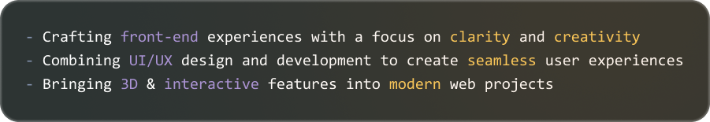

👋 Hi there !

I'm a **front-end developer** creating smooth, creative interfaces with **Vue.js**, **Svelte**, and **JavaScript** — driven by design, performance, and a passion for UX/UI and 3D.

Feel free to reach out on <a href="https://www.linkedin.com/in/loic-monard/">LinkedIn</a>.
